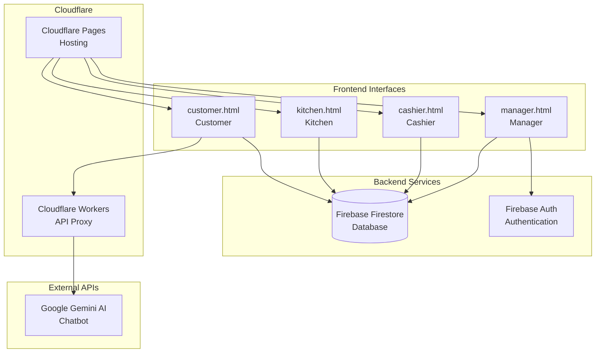
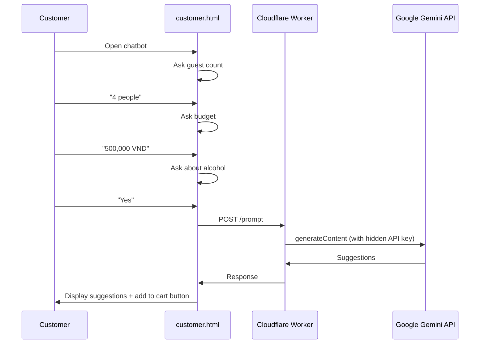
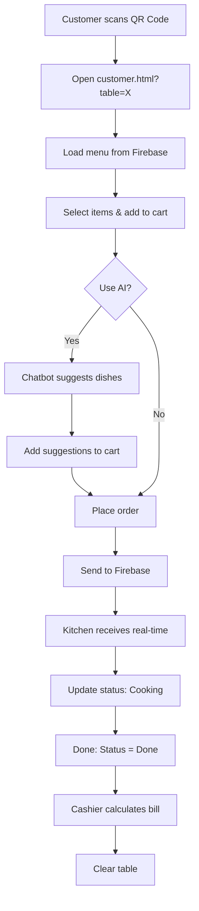

# 📋 Technical Report - Yaki Restaurant Order System

## 1. System Overview

**Yaki Restaurant Order System** is a QR-based table ordering system built entirely with Frontend technologies (HTML/CSS/JavaScript) combined with cloud services (Firebase, Cloudflare).

### 1.1 System Architecture



### 1.2 Tech Stack

| Technology         | Purpose                 |
| ------------------ | ----------------------- |
| HTML/CSS/JS        | Frontend (No framework) |
| Firebase Firestore | Real-time Database      |
| Firebase Auth      | Manager Authentication  |
| Cloudflare Pages   | Static Hosting          |
| Cloudflare Workers | Secure API Proxy        |
| Google Gemini      | AI Chatbot              |
| Service Worker     | Image Caching           |

---

## 2. Main Interfaces

### 2.1 Customer Interface (`customer.html`)

**Purpose:** Customer-facing menu and ordering interface.

#### Workflow:

1. **QR Code Access:**
   - URL format: `customer.html?table=3`
   - System reads `table` parameter to identify the table

2. **Menu Display:**
   - Load categories from `db.collection('categories')`
   - Load products from `db.collection('products')`
   - Render menu by category tabs
   - Support 5 languages: Vietnamese, English, Chinese, Japanese, Korean

3. **Cart Management:**
   - Store in memory `cart` object
   - Persist to `localStorage` with key `yaki_cart_table_{tableId}`
   - Display cart panel with editable quantities

4. **Order Placement:**
   - Send order to Firebase: `db.collection("tables").doc("table_{id}")`
   - Merge new items into existing `orders` array
   - Update `lastUpdated` timestamp

5. **Real-time Order Tracking:**
   - Use `onSnapshot()` to listen for Firebase changes
   - Update status: Pending → Cooking → Done
   - Display in "Ordered Items" panel

#### Key Code:

```javascript
// Listen for real-time updates
function listenToTableOrders() {
  const tableRef = db.collection("tables").doc(`table_${currentTableId}`);
  tableRef.onSnapshot((doc) => {
    orderedItems = doc.data()?.orders || [];
    renderOrderedItems();
    updateOrderedTotal();
  });
}

// Place order
function placeOrder() {
  tableRef.set(
    {
      name: `Table ${tableIndex}`,
      orders: newOrders,
      lastUpdated: firebase.firestore.FieldValue.serverTimestamp(),
    },
    { merge: true },
  );
}
```

---

### 2.2 Kitchen Interface (`kitchen.html`)

**Purpose:** Display orders for kitchen staff.

#### Features:

- **View Only:** Cannot edit quantities
- **Status Updates:** Can mark Pending → Cooking → Done
- **Real-time:** Instant notification for new orders
- **Login Required:** Kitchen password required

#### Data Flow:

```
Firebase → onSnapshot() → Render tables with orders → Display items with status
```

---

### 2.3 Cashier Interface (`cashier.html`)

**Purpose:** Payment and order management.

#### Permissions:

- View all orders
- Edit item quantities
- Delete items from orders
- Clear table (after payment)
- View cooking status (read-only)

#### Payment Flow:

1. Calculate table total
2. Confirm payment
3. Delete orders from Firebase document
4. Reset table to empty state

---

### 2.4 Manager Interface (`manager.html`)

**Purpose:** Full system administration.

#### Management Tabs:

| Tab            | Function                                       |
| -------------- | ---------------------------------------------- |
| **Tables**     | View all tables and orders                     |
| **Products**   | CRUD products (multi-lang names, price, image) |
| **Categories** | Add/edit/delete categories                     |
| **Settings**   | Configure table count, restaurant info         |

#### Authentication:

- Uses Firebase Authentication
- Admin-only access

---

## 3. AI Chatbot System

### 3.1 Chatbot Architecture



### 3.2 Cloudflare Worker (`worker/src/index.js`)

**Purpose:** Secure proxy to hide API key from client.

```javascript
// Endpoint: POST /
export default {
  async fetch(request, env) {
    const body = await request.json();

    // Call Gemini API with secret key
    const response = await fetch(
      `${GEMINI_API_URL}?key=${env.GEMINI_API_KEY}`,
      {
        method: "POST",
        body: JSON.stringify({
          contents: [{ parts: [{ text: body.prompt }] }],
          generationConfig: { temperature: 0.7, maxOutputTokens: 4096 },
        }),
      },
    );

    return new Response(JSON.stringify({ success: true, response: text }));
  },
};
```

### 3.3 Conversation Flow

| Step | Bot Asks            | User Responds        | Processing                       |
| ---- | ------------------- | -------------------- | -------------------------------- |
| 1    | "How many guests?"  | "4"                  | `chatState.guests = 4`           |
| 2    | "Your budget?"      | "500000"             | `chatState.budget = 500000`      |
| 3    | "Alcohol?"          | "1" (Yes) / "0" (No) | `chatState.alcohol = true/false` |
| 4    | -                   | -                    | Send prompt → Gemini API         |
| 5    | Display suggestions | "1" (Add) / "0" (No) | Add to cart                      |

---

## 4. Service Worker - Image Caching (`sw.js`)

### 4.1 Cache Strategy

**Cache-First Strategy:**

1. Check cache first
2. If exists → return immediately (fast)
3. If not → fetch from network → save to cache → return

```javascript
self.addEventListener("fetch", (event) => {
  if (!isImageRequest(request)) return;

  event.respondWith(
    caches.match(request).then((cached) => {
      if (cached) return cached; // Cache hit

      return fetch(request).then((response) => {
        caches.open(CACHE_NAME).then((cache) => {
          cache.put(request, response.clone());
        });
        return response;
      });
    }),
  );
});
```

### 4.2 Allowed Domains

```javascript
const ALLOWED_IMAGE_DOMAINS = [
  "github.com",
  "raw.githubusercontent.com",
  "images.unsplash.com",
  "firebasestorage.googleapis.com",
  // ...
];
```

### 4.3 Image Preloading

On page load, preload all product images:

```javascript
function preloadAllImages() {
  for (const category in products) {
    products[category].forEach((item) => {
      const img = new Image();
      img.src = item.img; // Trigger fetch → SW caches
    });
  }
}
```

---

## 5. Firebase Data Structure

### 5.1 Collections

```
firestore/
├── tables/
│   ├── table_1
│   │   ├── name: "Table 1"
│   │   ├── orders: [{id, name, price, qty, status}, ...]
│   │   └── lastUpdated: Timestamp
│   └── table_2, table_3...
│
├── products/
│   └── {productId}
│       ├── name: {vi, en, zh, ja, ko}
│       ├── price: Number
│       ├── img: String (URL)
│       └── category: String
│
├── categories/
│   └── {categoryId}
│       ├── name: {vi, en, zh, ja, ko}
│       └── order: Number
│
└── settings/
    └── tables
        └── count: Number
```

### 5.2 Order Item Structure

```javascript
{
    id: "prod_123",           // Product ID
    name: {
        vi: "Thịt bò nướng",
        en: "Grilled Beef",
        // ...
    },
    price: 120000,            // VND
    qty: 2,                   // Quantity
    status: "cooking"         // pending | cooking | done
}
```

---

## 6. Internationalization (i18n)

### 6.1 Translations Object

```javascript
const translations = {
    vi: {
        table: "Bàn",
        buttons: { order: "Đặt món", cart: "Giỏ hàng", ... },
        cart: { title: "Giỏ hàng", total: "Tổng cộng", ... },
        chatbot: { greeting: "Xin chào!", askGuests: "Có bao nhiêu người?", ... }
    },
    en: { ... },
    zh: { ... },
    ja: { ... },
    ko: { ... }
};
```

### 6.2 Language Selection Flow

1. User selects language from dropdown
2. Save to `localStorage.setItem('yaki_language', lang)`
3. Re-render: tabs, menu items, cart, ordered items, chatbot

---

## 7. Complete System Flow



---

## 8. Security

| Component           | Measure                              |
| ------------------- | ------------------------------------ |
| **API Keys**        | Hidden in Cloudflare Worker secrets  |
| **Firebase**        | Security rules for read/write access |
| **Admin Access**    | Firebase Auth with email/password    |
| **Kitchen/Cashier** | Simple password (upgradeable)        |

---

## 9. Deployment

| Service                | Purpose           | URL Pattern                         |
| ---------------------- | ----------------- | ----------------------------------- |
| **Cloudflare Pages**   | Host static files | `yaki.pages.dev`                    |
| **Cloudflare Workers** | API Proxy         | `gemini-proxy.yaki-api.workers.dev` |
| **Firebase**           | Database + Auth   | Project console                     |

---

## 10. Summary

**Yaki** is a modern ordering system featuring:

- ✅ **QR Code ordering** - No app installation required
- ✅ **Real-time updates** - Firebase snapshots
- ✅ **AI-powered suggestions** - Google Gemini
- ✅ **Multi-language** - 5 languages supported
- ✅ **Offline-first images** - Service Worker caching
- ✅ **Role-based access** - Customer/Kitchen/Cashier/Manager
- ✅ **Serverless architecture** - No dedicated backend needed

---

**© 2024 Huy Huynh. All rights reserved.**
